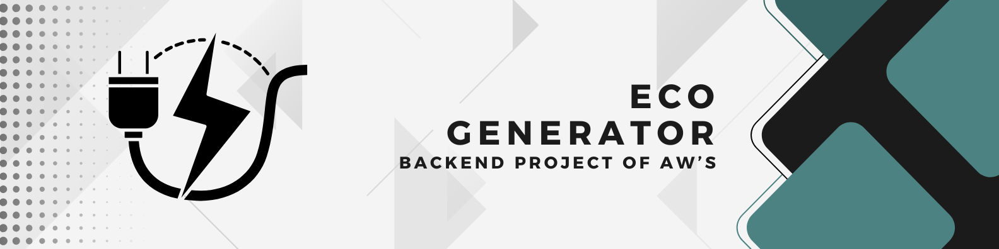
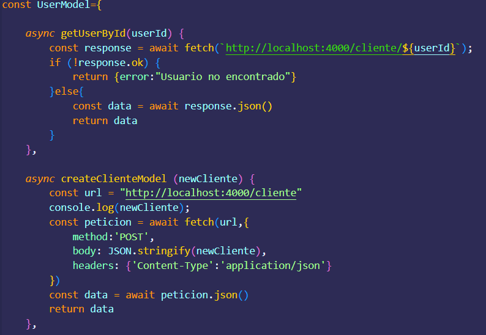

<!-- PROJECT LOGO -->




  <h3 align="center">API RESTFul EcoGenerator</h3>

  <p align="center">
    Backend Project for the Bimonthly Exam
  </p>


<!-- TABLE OF CONTENTS -->
<details>
  <summary>Table of Contents</summary>
  <ol>
    <li>
      <a href="#about-the-project">About The Project</a>
      <ul>
        <li><a href="#built-with">Built With</a></li>
      </ul>
    </li>
    <li><a href="#installation">Installation</a></li>
      </ul>
    </li>
    <li><a href="#contact">Contact</a></li>
  </ol>
</details>


<!-- ABOUT THE PROJECT -->
## About The Project



This project proposes a solution so that the user can visualize and have knowledge about light generators.

<p align="right">(<a href="#readme-top">back to top</a>)</p>


### Built With

Below you can see the tools that were used in this project.

* 

* 

* 

* 

* 

* 

* 

* 

* 

* 

<p align="right">(<a href="#readme-top">back to top</a>)</p>

### Installation

_Below is an example of how you can instruct your audience on installing and setting up your app. This template doesn't rely on any external dependencies or services._

1. Clone the repo
   ```sh
   git clone https://github.com/DarthEdu/EcoGenerator.git
   ```
2. Install NPM packages
   ```sh
   npm i
   ```

<p align="right">(<a href="#readme-top">back to top</a>)</p>

<!-- CONTACT -->
## Contact

* Eduardo Porras - [@GitHub](https://github.com/DarthEdu)
* Martin Ayala - [@GitHub](https://github.com/MartinXde23)
* Jose Bernal - [@GitHub](https://github.com/JoseBernal06)
* Dennis Diaz - [@GitHub](https://github.com/DonRuffo)
* Mateo Tacuri

<p align="right">(<a href="#readme-top">back to top</a>)</p>